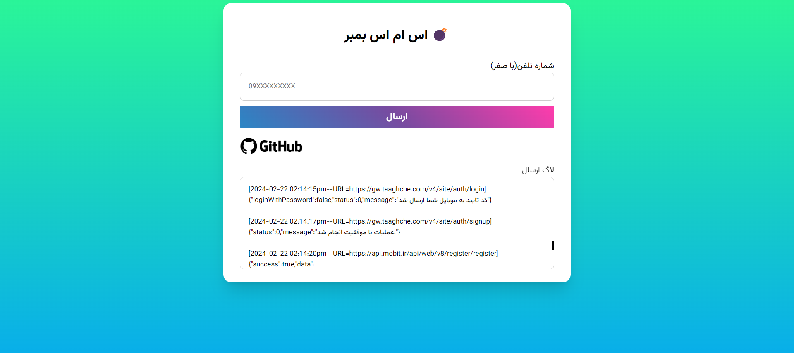

# PHP SMS Bomber Script 💣
to run you have to copy all files on a folder and copy folder on htdocs by xampp then active xampp and search localhost/(folder name that you coped to htdocs)    or rin index.php by php runner 
for stop deactive the xampp or your internet connections
please install req.txt's packages by (pip install -r req.txt) in general command 

